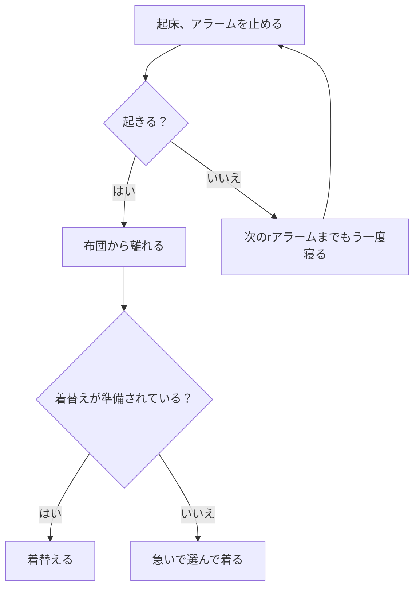
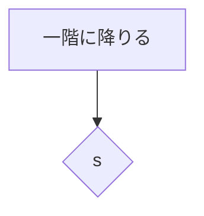

# 朝のルーティン

```mermaid
flowchart TD
 A[起床、アラームを止める] --> B{起きる？}
 B -->|はい| C[布団から離れる]
 B -->|いいえ| D[次のrアラームまでもう一度寝る]
 D --> A
 C --> E{着替えが準備されている？}
 E -->|はい| F[着替える]
 E -->|いいえ| G[急いで選んで着る]
```

```mermaid
flowchart TD
A[一階に降りる] --> B{s}
```